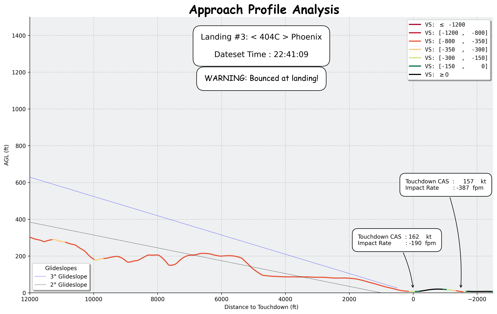

 

# ✈️ Landing Rate Analysis  

This project analyzes **Approach** and **Landing** performance from any given *flight data telemetry* containing multiple aircraft at once (real data, DCS, MSFS, etc.) to determine all **Final Approach** glideslopes, extract key touchdown/impact parameters, and generates visualizations of the landing approach and touchdown.

>**Disclaimer** The project is still under development. Some features may not be fully implemented yet.

## 📑 Flight Data Telemetry

This projects works on any flight data telemetry allowing the extraction of following features:

---

| Feature   | Type      | Description                                                                 | Notes |
|-----------|-----------|-----------------------------------------------------------------------------|-------|
| **Pilot ID / Name** | *String*                       | Unique identifier of the pilot (acts as the **primary key**) | Must be unique per pilot in dataset |
| **Datetime**        | *Timestamp*                    | Exact date and time of the recorded telemetry entry |  |
| **AGL** (Altitude Above Ground Level) | *Float (ft)* | Aircraft altitude relative to the ground directly beneath |  |
| **VS** (Vertical Speed)| *Float (ft/min)*            | Vertical speed at given moment | Can be calculated from rate of change of MSL altitude |
| **CAS** (Calibrated Airspeed) | *Float (knots)* | Airspeed corrected for instrument/position errors |  |

---

## 🗽 Credits:
- Fardad Pouran, callsign "*< 404 > D1CE*".
- *404th Freelancers* Virtual Squadron DCS community.
- [Tacview](https://www.tacview.net): exports flight telemetry data.

⚠️ **Note**: The dataset included for exhibition is from a massive flight data flown by 404th community. Here, the dataset is filtered to only two pilots to reduce the file size.

## 🎯 Features
### 📉 Approach Analysis: 
-   Visualizes **final approach glideslope** for each aircraft. Each descent segment is rated by a color.
  - Also identifies if the aircraft bounces upon touchdown!


    <p align="left">
    
    </p>


### 🛬 Touchdown Criteria: 
- Extracts and plots key touchdown quantities: 

  | Quantity | Unit | Description |
  | --- | --- | --- |
  | **Vertical Speed** |  $\text{\textit{fpm}}$ | Vertical speed at touchdown |
  | **Vertical Acceleration** | $\textit{fpm}^2$ | Vertical impact-force/acceleration on aircraft CG|
  | **Jerk** | $\textit{fpm}^3$ | Sudden change of impact-force/acceleration on aircraft's CG |

    <p align="left">
    
    </p>

### Landing Rating Table
- CSS styles landing table for each aircraft and each sortie.
- Exports `.csv` of the table.

  <p align="left">
    
    </p>

## 🚧 To be added
- **Landing Rating Criteria**: Customizable criteria for rating the landing performance.
  - Impact **G-force**.
  - $\delta$: Landing gear stroke (gear compression distance when the gear absorbs the impact).
  - **Impact Time**: Time interval when gears are compressed until stabilization.
- **User Interface**: A user-friendly GUI for easy interaction with the analysis tools.

## 🗂️ Folder Structure

- `Datasets/`: Raw CSV data.
- `Results/`:  Analysis results: Approach plots and landing rating CSV file.
- `Detailed Touchdowns/`: Contains detailed plots of each touchdown/impact.
- `Landing Rate.ipynb`: The main Jupyter Notebook for the analysis.

## 🖥️ Installation

1. Clone the repository:
   ```bash
   git clone https://github.com/fardad-d1ce/Landing-Rating.git
   ```
2. Install the required Python libraries:
   ```bash
   pip install datetime numpy pandas matplotlib seaborn
   ``` 
## 📖 User Guide
1. Place your raw CSV data in the `Datasets/` folder.
2. Run the `Landing Rate.ipynb` notebook.
3. Check the `Results/` folder for the analysis outputs.
4. Explore the `Detailed Touchdowns/` folder for detailed plots of each touchdown/impact.
