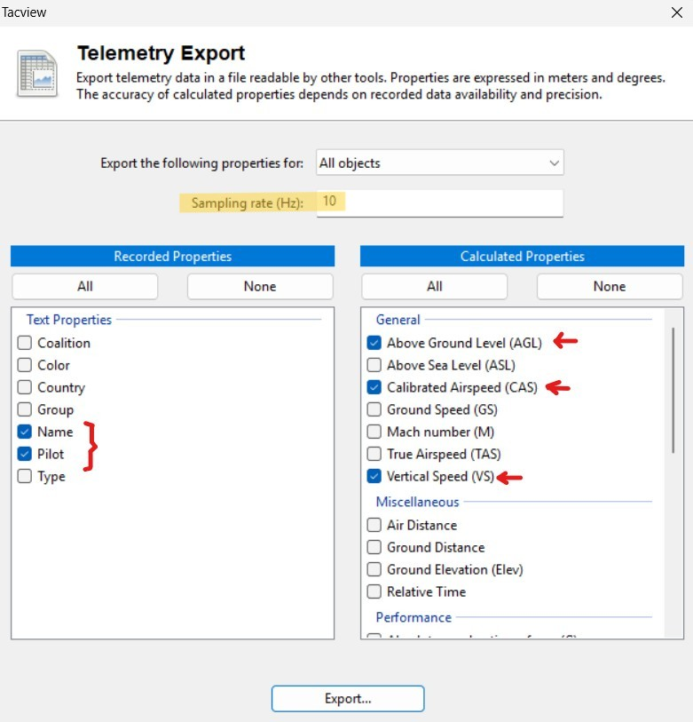
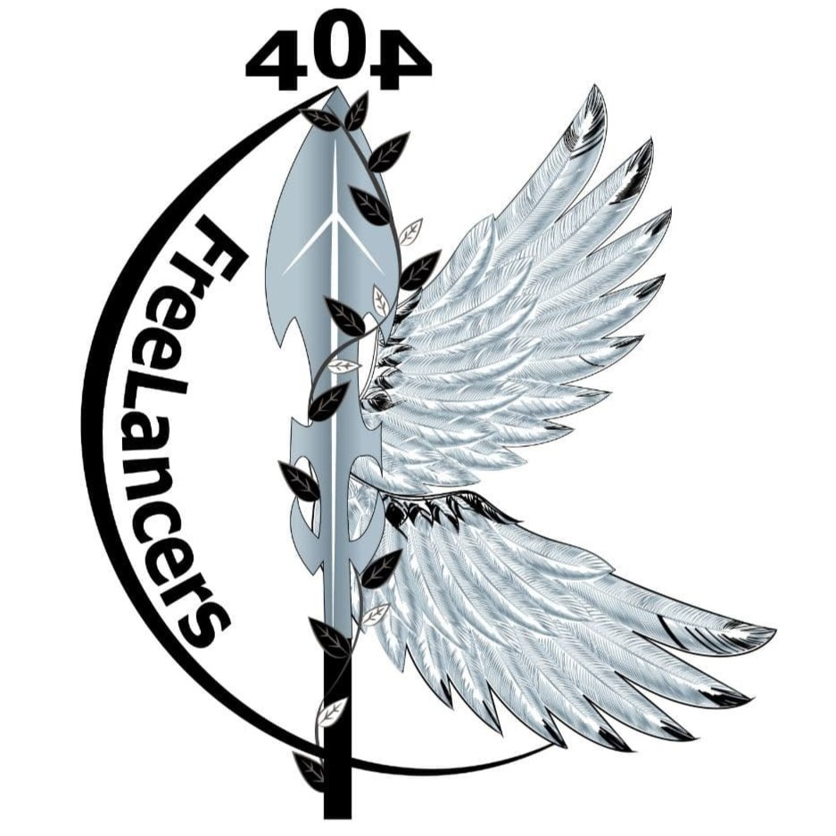

 

# ✈️ Landing Rate Analysis  

Bonjour!

This is Fardad "D1CE" Pouran, from "*404th Freelancers*"!

This project analyzes **Approach** and **Landing** performance from any given *flight data telemetry* containing multiple aircraft at once (real data, DCS, MSFS, etc.) by visualizing all **Final Approach** profiles all the way to touchdown and beyond, and extracting key touchdown/impact parameters.

⚠️ **Note**: The dataset included for exhibition is exported from a [Tacview](https://www.tacview.net) file on a flight data flown by 404th community. The dataset is filtered to only two pilots to reduce the file size.

## 🎯 Features
### 📉 Approach Analysis: 
-   Visualizes **final approach glideslope** for each aircraft. Each descent segment is rated by a color.
  - Also identifies if the aircraft bounces upon touchdown!


    <p align="left">
    
    </p>


### 🛬 Touchdown Criteria: 
- Extracts and plots key touchdown quantities: 

  | Quantity | Unit | Description |
  | --- | --- | --- |
  | **Vertical Speed** |  *fpm* | Vertical speed at touchdown |
  | **Vertical Acceleration** | *fpm<sup>2</sup>* | Vertical impact-force/acceleration on aircraft CG|
  | **Jerk** | *fpm<sup>3</sup>* | Sudden change of impact-force/acceleration on aircraft's CG |

    <p align="left">
    
    </p>

### Landing Rating Table
- CSS stylized landing table for each aircraft and each sortie.
- Exports `.csv` of the table.

  <p align="left">
    
    </p>

## 🚧 To be added
- **Better Aesthetics**: Improved visualizations for  presentation.
- **Landing Rating Criteria**: Customizable criteria for rating the landing performance.
  - Impact **G-force**.
  - $\delta$: Landing gear stroke (gear compression distance when the gear absorbs the impact).
  - **Impact Time**: Time interval when gears are compressed until stabilization.
- **User Interface**: A user-friendly GUI for easy interaction with the analysis tools.

## 🗂️ Project Structure

- `Datasets/`: Raw CSV data.
- `CONFIG_HERE.toml`: Main configuration file for analysis parameters.
- `Results/`:  Approach plots and landing ratings, etc.
- `run_analysis.py`: Main pipeline orchestrator.
- `Landing Rate.ipynb`: Jupyter Notebook for presentations.

## 🖥️ Installation

### Prerequisites
- **Python 3.13+**
- **[uv](https://docs.astral.sh/uv/)** (Fast Python package and project manager)

### Setup Instructions

1. **Clone the repository:**
   ```bash
   git clone https://github.com/fardad-d1ce/Landing-Rating.git
   cd Landing-Rating
   ```

2. **Install dependencies:**
   This project uses `uv` for dependency management. To automatically create a virtual environment and install all required packages, run:
   ```bash
   uv sync
   ```
   *(If you don't have `uv` installed, see the [official installation guide](https://docs.astral.sh/uv/getting-started/installation/)).*

## 📖 User Guide
0. For Taview users:
  Select sampling rate (recommend 10Hz), and export your flight data telemetry as a CSV file:
    <p align="center">
    
    </p>
 1. **Prepare your data:** Place your raw CSV flight data in the `Datasets/` folder.
2. **Configure settings:** Open `CONFIG_HERE.toml` and update parameters like `CSV_PATH` and squadron info to match your dataset.
3. **Run the analysis:** You have two options to execute the pipeline:
   - **Option A: Main Orchestrator (Preferred)**  
     Run the Python script directly using `uv`:
     ```bash
     uv run run_analysis.py
     ```
   - **Option B: Jupyter Notebook (Interactive)**  
     Open `Landing Rate.ipynb` in your preferred IDE (select the `.venv` Python kernel) or run `uv run jupyter lab` to run the analysis step-by-step for presentations.
4. **View results:** Check the `Results/` folder for the analysis outputs and landing rating tables.
5. **Deep dive:** Explore the `Detailed Touchdowns/` folder for detailed plots of each touchdown/impact.

## 📑 Flight Data Telemetry

This project is optimized for *[Tacview](https://www.tacview.net)* export files, although it can still be used on any flight telemetry data allowing the following schema:

| Feature   | Type      | Description   | Notes |
|-|-|-|-|
| **Pilot ID / Name** | *String* | Unique identifier of the pilot (**primary key**) | Must be unique per pilot|
| **Datetime**        | *Timestamp* | Exact date and time of the recorded telemetry entry |  
| **AGL** (Altitude Above Ground Level) | *Float (ft)* | Aircraft altitude relative to the ground directly beneath |  
| **VS** (Vertical Speed)| *Float (ft/min)* | Vertical speed at given moment | Can be calculated from rate of change of MSL altitude |
| **CAS** (Calibrated Airspeed) | *Float (knots)* | Airspeed corrected for instrument/position errors |  

---
## 💙 Shoutouts & Acknowledgements  

Special thanks to *404th Freelancers* Virtual Squadron community for their support, feedback, and inspiration.

Check it out: 
<p align="left">
  <a href="https://youtube.com/@404freelancers" target="_blank">
    
  </a> &nbsp;&nbsp;&nbsp;
  <a href="https://instagram.com/404freelancers" target="_blank">
    
  </a>
</p>
<p align="left">
  
</p>


